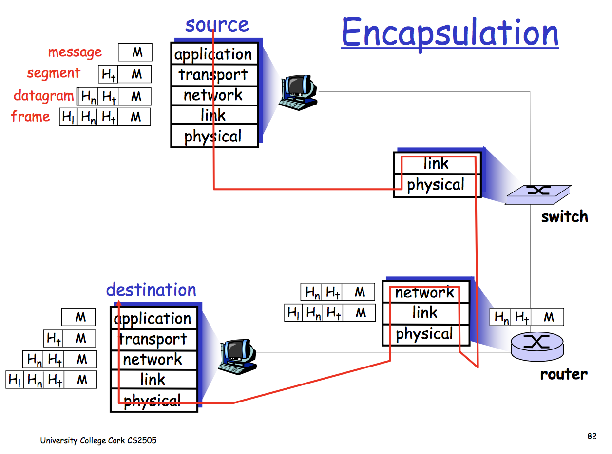

# Question 1: General Networking Concepts

## (a) True or False

### BitTorrent is a *pure* peer-to-peer system.

* Depends on the tracker

* If a centralised tracker is used, each peer registers with that tracker to get a list of peers to connect to, so it's not purely peer-to-peer.

* On the other hand, if a distributed tracker is used, then the tracker is spread across the peers, and it is a pure peer-to-peer system.

### 10000 Kb/s is a lower data rate than 1 Gb/s.

* True

* 1 Gb/s = 1000 Mb/s, 10000 Kb/s = 10 Mb/s

* 10 Mb/s < 1000 Mb/s

### Cloud computing servers are considered to be part of the network edge rather than the network core.

* True

* The network core is just switches and routers.

### UDP uses a checksum for demultiplexing a datagram to the correct socket.

* False

* Checksum is used for verifying messages haven't been corrupted.

### DNS is an application-layer protocol.

* True

## (b) Expand the following acronyms: DHT, RTT, NAK, HTTP, CDN.

* DHT = Distributed Hash Table

* RTT = Round Trip Time

* NAK = Negative Acknowledgement

* HTTP = Hypertext Transfer Protocol

* CDN = Content Distribution Network

# Question 2: Networking Fundamentals

## (a) Concerning encapsulation:

### (i) Why is it considered good practice to minimise the size of packet headers?

* Packet headers are added at each architecture layer, and are added to every packet. As they're not part of the content, if they're large they can hugely decrease throughput.

### (ii) Draw a diagram showing the encapsulation of a HTTP message as it passes through a network link.

* Some variant of the encapsulation diagram (Images/Encapsulation Diagram.png):

## (b)

* propagation delay and transmission delay

* transmission delay is L / R

* propagation delay is D / S

Total time is `L/R + D/S`

## (c)

### (i)

2 Mbps for 1/20th of a second = 0.1 Mbps

### (ii)

2 Mbps if it's the only computer currently active (it gets the full link)

# Question 3: Application Layer

## (a) HTTP Caching Proxies

### (iii)

* caching stops content providers from getting information about how you're using their page

* also means they can't serve personalised ads

* can't provide any customised experience through a cache (e.g. a login system)

## (b) Video Streaming

### (i) Playout Buffer

* Since network delays are variable, some video chunks may not arrive in time

* Rather than have the video pause at those moments, using a buffer means the next few chunks are always available.

    * if a chunk is delayed, the buffer will deplete

    * ideally the buffer is big enough that the chunk will arrive before the buffer runs out completely, meaning there's no interruption to the video

* the buffer is filled to a certain point at the beginning, will fill when some chunks arrive earlier than expected

### (ii) DASH

1. When to fetch the chunk

    * need to make sure the buffer doesn't empty but also that it doesn't overflow

2. What quality chunk to fetch

    * want the highest quality that's possible while guaranteeing uninterrupted playback at the client

3. Which server to fetch the chunk from

    * may choose low latency server or high bandwidth

# Question 4: Transport Layer

## (a)

### (i)

* rdt 2.0 FSM diagram

### (ii)

* if the sender receives a corrupt ACK/NAK, then it resends the current packet

    * e.g. use a checksum to detect the corrupted ACK/NAK

* there are now sequence numbers with the packets – either 0 or 1

* if the receiver receives a duplicate packet (same sequence number), it discards it and sends an ACK

## (b) TCP Header

### (i)

2^15^ bytes

### (ii)

To a random value.

### (iii)

No, they use separate sequence numbers.

### (iv)

It's the sequence number of the next expected byte.
