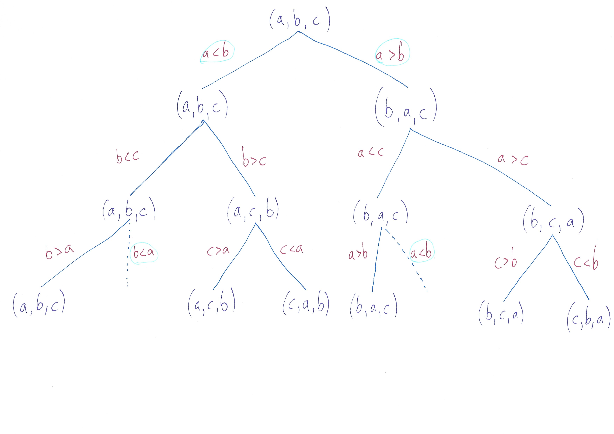

# Question 1 [10 marks]

A real-time company develops software that is guaranteed to be ”time-able”. More precisely, the company developed a programming language for which software can be timed in the following way: ahead of executing the software, the worst-case running time of this software can be determined by analyzing the code. The language developed by the company is not as powerful as Java. It can only compute a subset of the problems that Java can compute. Can the company create a language that is as powerful as Java for their safety-critical applications such that this language still has the same property, i.e. the worst-case time of all software can be determined? Justify your answer.

## Answer

No, but I’m not sure why.

# Question 2 [20 marks]

Construct the decision tree for the algorithm described by the following pseudo-code:

```
For i = 1 to n - 1 do
    If L[i] > L[i+1] then swap(L[i],L[i+1])
For i = n-1 down to 2 do
    If L[i] < L[i-1] then swap(L[i],L[i-1])
```

Note that this code does not determine a sorting algorithm. However, on lists of size 3, the code does sort these lists. Produce the decision tree of this algorithm for lists of size 3.

## Answer

See figure \ref{decisionTree}.



# Question 3 [10 marks]

## a) (5 marks)

State a semi-modularity inequality that holds for the best-case time for the sequential composition of programs P and Q.

### Answer

The best-case time for the composition is if the best-case input for $P$ produces an output that is a best-case input for $Q$, but this won’t always happen.

This inequality describes that:

$T^B_{P;Q}(A) \neq T^B_P(A) + T^B_Q(O_P(A))$

(Here $A$ is a set of possible inputs, and $O_P(A)$ is the output that $P$ produces on that set.)

## b) (5 marks)

When does equality hold? State a condition on P or Q that guarantees equality to hold for the inequality you stated under a). Justify your answer.

### Answer

If either $P$ or $Q$ is a constant-time algorithm, then equality will hold.

If $P$ is a constant-time algorithm, then the running time for the composition only varies with the running time of $Q$. So, the worst-case time for the composition will be the worst-case time of $Q$ when run on the outputs of $P$.

Here is an equality that describes that:

$T^B_{P;Q}(A) = T_P(A) + T^B_Q(O_P(A))$

The same argument can be made for if $Q$ is a constant time algorithm.
