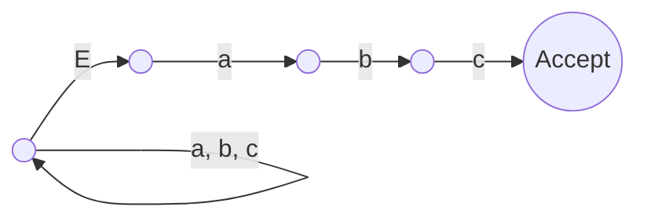

# Question 1 (30%)

## (i) (10%)

### Question

Give (a) a regular expression and (b) a deterministic finite automaton to capture the set of strings over alphabet {a, …, z} that contain at most one a and at most one b.

### Answer

Regular expression: `[c-z]*((a?[c-z]*b?)|(b?[c-z]*a?))[c-z]*`

Deterministic finite automaton:

.png)

## (ii) (10%)

### Question

What language is recognised by the following non-deterministic finite automaton? Give a deterministic equivalent. Symbol E denotes $\epsilon$.



### Answer

The language is the set of strings that end with “abc”.

Here is a DFA for that:

.png)

## (iii) (10%)

### Question

Show how a regular expression may be translated into an equivalent NFA, using `a(b|c)*d` to illustrate the technique.

### Answer

Each regex operation can be represented by a particular shape of NFA. These shapes can be put together in the order of the regex.

For example, `a|b` has the following shape (`E` represents $\epsilon$):

 Choice.png)

`ab` has the following shape:

 Concatenation.png)

`a*` has the following shape:

 Star.png)

`a+` has the following shape:

 Plus.png)

So for `a(b|c)*d`, we can combine these operations to give:

 Answer.png)

# Question 2 (25%)

## (i) (15%)

### Question

The following is an example of a program written in a simplified Python-like syntax. While pure Python is whitespace-sensitive, our variant uses special symbols (end-line), (indent), and (outdent) to indicate program structure explicitly.

```python
n = 1 (end-line)
while n < 100:
  (indent)
  n = n + 2 (end-line)
  (outdent)
```

Give a grammar for this mini-language that respects the following rules:

- A program consists of a sequence of statements
- Which can be assignment statements, while statements, or if statements
- Assignment statements have Java-like syntax but are terminated with an (end-line) instead of a semicolon
- Multi-line assignments are disallowed
- The condition of a while/if is delimited by the keyword and a colon
- The body is delimited by (indent) and (outdent) symbols

You may assume that grammar productions to capture the syntax of expressions have already been written and you may use the resulting non-terminal `<exp>` in your grammar.

### Answer

```CFG
<program> -> <statement-list>
<statement-list> -> <statement> | <statement> <statement-list>
<statement> -> <assignment-statement> | <if-statement> | <while-statement>
<assignment-statement> -> id = <exp> (end-line)
<if-statement> -> if <exp> colon <body>
<while-statement> -> while <exp> colon <body>
<body> -> (indent) <statement-list> (outdent)
```

## (ii) (10%)

### Question

Draw a parse tree for the example python program shown above. You need not complete any subtrees representing `<exp>` constructs.

### Answer

.png)
