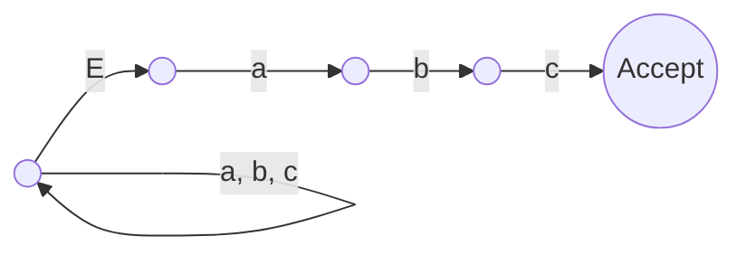

# Question 1 (30%)

## (i) (10%)

### Question

Give (a) a regular expression and (b) a deterministic finite automaton to capture the set of strings over alphabet {a, …, z} that contain at most one a and at most one b.

### Answer

Regular expression: `[c-z]*((a?[c-z]*b?)|(b?[c-z]*a?))[c-z]*`

Deterministic finite automaton:

.png)

## (ii) (10%)

### Question

What language is recognised by the following non-deterministic finite automaton? Give a deterministic equivalent. Symbol E denotes $\epsilon$.

### Answer

The language is the set of strings that end with “abc”.

Here is a DFA for that:

.png)

## (iii) (10%)

### Question

Show how a regular expression may be translated into an equivalent NFA, using `a(b|c)*d` to illustrate the technique.

### Answer

Each regex operation can be represented by a particular shape of NFA. These shapes can be put together in the order of the regex.

For example, `a|b` has the following shape (`E` represents $\epsilon$):

 Choice.png)

`ab` has the following shape:

 Concatenation.png)

`a*` has the following shape:

 Star.png)

`a+` has the following shape:

 Plus.png)

So for `a(b|c)*d`, we can combine these operations to give:

 Answer.png)
