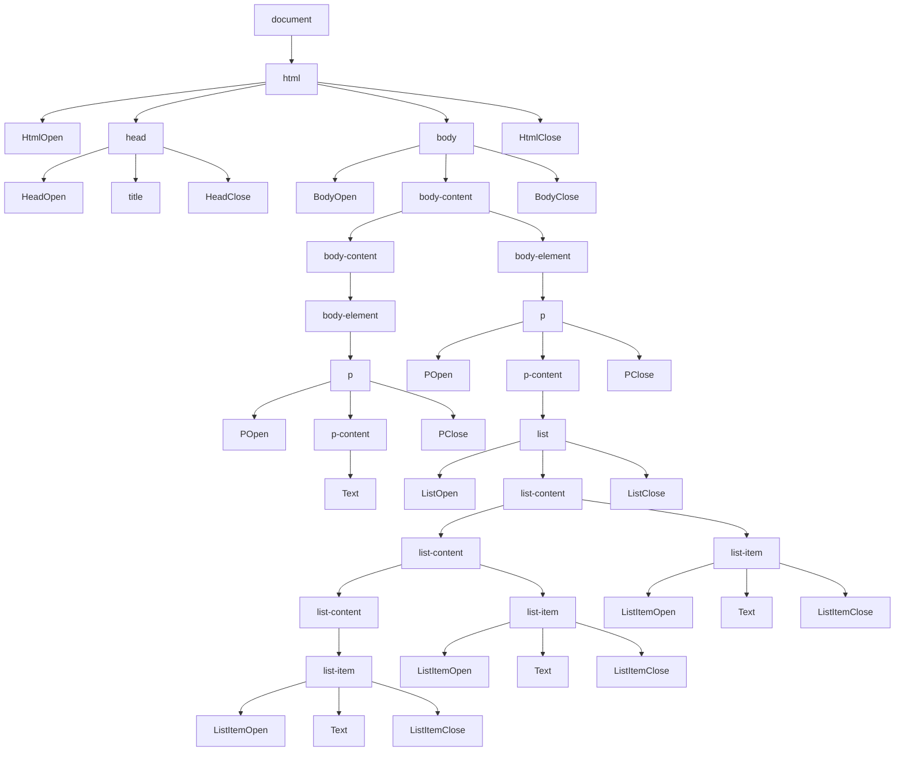

# Question 1 (30%)

## (i) (8%)

### Question

Give a deterministic finite automaton for the set of binary strings such that every block of three consecutive bits contains at least one 1. (Hint: Use the automaton states to represent the two preceding bits at each stage.)

### Answer

Any string that has a sequence of 3 zeroes in a row should be rejected, any other sequence should be accepted (assuming blocks may overlap). So we just need to recognise three zeroes in a row.

My graph below does this with 9 states. If all input strings are at least length 3, you can remove states A, B, C, E, and F, giving a new start state of G. The core is the three accept states G, H, and I.

.png)

## (ii) (6%)

### Question

Describe in English the set of strings accepted by the automaton depicted below. Give a regular expression for the set of strings.

.png)

### Answer

The set of binary strings that contain the substring 10.

Can be denoted by: `(0|1)*10(0|1)*`

### Method

Working from the start state, you can have:

- any number of zeroes
- followed by 1 or more ones
- followed by a zero
- followed by any number of any other characters

A regex for this is `0*1+0(0|1)*`.

The smallest thing that’s accepted by this is `10`, where the `*`s are read as 0 occurrences, and the `+` is read as one occurrence.

After this `10` you can have any string, including more occurrences of `10`. So, e.g. `1010` passes, where the first `10` is the mandatory one, and the second matches `(0|1)*`.

Before this `10`, you can only have a string of zeroes followed by a string of ones, e.g. `00001111` or `000` or `111`.

Any other string going before this `10` (e.g. `11110000`) would contain `10`,  and so would still match the regex, but with the initial `10` matching the mandatory `10`.

Thus the regex matches any string that contains the substring `10`.

## (iii) (7%)

### Question

Give a regular expressions for the set of all binary strings that do not contain a pair of adjacent 0’s.

### Answer

`1*0(1|10)*`

### Method

- started by looking at expanding the string in both directions from an initial 0
  - e.g. start with `0`, then think about `(1+01+)*`
  - but that doesn’t accept `0` or `0111`
  - fixing that while working in two directions seemed complicated
- decided to limit to one direction, i.e. moving forward along the string (not sure how to justify this)
- so now I want a `0` followed optionally by some number of ones and then a zero: `0(1+0)*`
- and then can also allow optional leading 1s: `1*0(1+0)*`
  - but this doesn’t allow e.g. `01`
- so `1*0(10?)*`, which is the same as `1*0(1|10)*`
- and can also convert this back to two directions: `(01|1)*0(1|10)*`

## (iv) (9%)

### Question

Construct a finite automaton equivalent to the following regular expression 10|(0|11)0 ∗ 1.

### Answer

.png)

### Method

`10|(0|11)0*1`

Split into two branches. `10` is trivial, so look at `(0|11)0*1`:

- Has to end with a `1`
- Starts with `0` or `11`
- May contain a run of `0`s in the middle

So, examples include `01, 001, …`, `111, 1101, …`, and `10`.

Start with the path for `01, 001, …`:

 - Method 1.png)

Then add the path for `111, 1101, …`:

 - Method 2.png)

Then the path for `10`:

 - Method 3.png)

# Question 2 (20%)

## (i) (15%)

### Question

Formulate a context free grammar for the following simple subset of HTML. Documents contain no text or content and involve the following tags only: html, head, title, body, h1, p, ol, li. Documents also contain no attributes, CSS or scripts– just tags drawn from the list above.

The grammar should respect as faithfully as possible the standard HTML constraints on the order- ing, sequencing and nesting of such tags.

The body of the document may contain any number of paragraphs. Each paragraph may optionally contain one or more lists. List items may optionally contain other lists.

### Answer

- Terms in lowercase are non-terminals
- Terms in UpperCamelCase are terminals
  - HtmlOpen = `<html>`, ListClose = `</li>`, etc.
  - Text = any string not containing a html tag
- Whitespace is ignored

```
document -> html
html -> HtmlOpen head body HtmlClose
head -> HeadOpen title HeadClose
title -> TitleOpen Text TitleClose
body -> BodyOpen body-content BodyClose
body-content -> body-element | body-content body-element
body-element -> h1 | p
h1 -> H1Open Text H1Close
p -> POpen p-content PClose
p-content -> Text | list
list -> ListOpen list-content ListOpen
list-content -> list-item | list-content list-item
list-item -> list | ListItemOpen Text ListItemClose
```

## (ii) (5%)

### Question

Give a complete parse tree for the following document:

```
<html>
  <head><title></title></head>
  <body>
    <p></p>
    <p>
      <ol>
        <li></li>
        <li></li>
        <li></li>
      </ol>
    </p>
  </body>
</html>
```

### Answer


